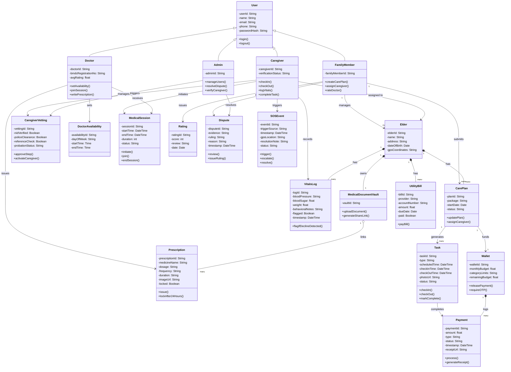

# Software Requirements Specification

## Elder Care
*A digital platform to prevent elderly neglect in Bangladesh*

**CSE470: Software Engineering**
**BRAC University**
**Group - 4**
**Sec - 16**

| Member Name | Student ID |
|---|---|
| Baktier Galib | 23301302 |
| Muntasir Fahim | 22201800 |
| Pranto Mahmud | 22201682 |
| Sadhman Hossain | 21301734 |

---

## 1. Introduction

Elder Care is a proxy-child and elderly care platform built for families who cannot be physically present with their elderly relatives. It connects four types of users: family members managing care remotely, caregivers visiting the elderly on the ground, doctors providing remote medical consultations, and platform admins ensuring trust and operations.

In Bangladesh, adult children often migrate abroad or to other cities for work, leaving elderly parents without consistent care or oversight. Neglect and isolation remain common even when a relative lives with the elder. Elder Care addresses this by providing transparency, accountability, emergency response, and remote medical access, without requiring any family member to be physically present.

The system is designed around four dashboards. The caregiver dashboard supports on-ground visits and health logging. The family dashboard supports remote monitoring, care planning, and payments. The doctor dashboard supports remote consultations. The admin dashboard supports vetting, dispute resolution, and platform oversight.

---

## 2. Functional Requirements

### 2.1 Caregiver Dashboard

- **FR-01.** The system shall allow the caregiver to check in and check out at the elder's location, validating the action against the registered address within 50 meters and requiring a timestamped photo at check out.
- **FR-02.** The system shall allow the caregiver to initiate a video consultation with an available doctor during the doctor's set availability window, using the 100ms.live integration.
- **FR-03.** The system shall allow the caregiver to upload a prescription image, storing it and linking it to the elder's profile for the doctor and family member to view.
- **FR-04.** The system shall allow the caregiver to log the elder's daily vitals and behavioral notes, flagging entries with decline keywords for family review.
- **FR-05.** The system shall allow the caregiver to view and complete assigned tasks, requiring an active check-in before a task can be marked complete.

### 2.2 Family Dashboard

- **FR-06.** The system shall allow the family member to create a care plan, choose a service package, and assign a caregiver from the platform's vetted pool.
- **FR-07.** The system shall allow the family member to set a monthly budget and category spending limits, releasing payment to the caregiver automatically when a task is GPS-verified, with approval required for manual releases above 10,000 BDT.
- **FR-08.** The system shall allow the family member to pay the elder's utility bills through the platform's payment gateway, using a manually entered or photographed bill amount, and save the receipt to the elder's profile.
- **FR-09.** The system shall provide a medical document vault where the family member can store the elder's health records and share them through a time-limited link.
- **FR-10.** The system shall display a real-time care status feed to the family member, showing check-ins, vitals, task completion, and session logs.

### 2.3 Doctor Dashboard

- **FR-11.** The system shall allow the doctor to accept or decline a session request within 60 seconds and join the video consultation during their marked availability window.
- **FR-12.** The system shall allow the doctor to view all prescription images uploaded by the caregiver for the elder.
- **FR-13.** The system shall allow the doctor to write session notes and issue a digital prescription, locking both from editing 24 hours after submission.
- **FR-14.** The system shall allow the doctor to manage their availability schedule by day and time range.
- **FR-15.** The system shall allow the family member to rate the doctor and leave an optional written review after a session.

### 2.4 Admin Dashboard

- **FR-16.** The system shall allow the admin to create, edit, and deactivate user accounts for all roles, preserving historical data on deactivation.
- **FR-17.** The system shall allow the admin to manage the caregiver vetting pipeline, including NID verification, police clearance review, reference checks, and a probation period before activation.
- **FR-18.** The system shall allow the admin to review evidence and issue a ruling on escrow payment disputes between the family member and the caregiver.
- **FR-19.** The system shall trigger an SOS alert to the family member automatically, escalating to the admin if unresolved within 15 minutes.
- **FR-20.** The system shall provide the admin with an analytics dashboard and the ability to export platform reports as CSV or PDF.

---

## 3. Tools and Technologies

### 3.1 Core Stack

- MERN Stack: MongoDB, Express.js, React, and Node.js
- MongoDB for the primary database
- Express.js for the REST API layer, following MVC architecture
- React for the frontend across all four dashboards
- Node.js as the application runtime

### 3.2 Third-Party Integrations

- 100ms.live for video consultations
- imgbb for prescription image storage
- Brevo for email push notifications
- Device GPS APIs for GeoIP check in and check out validation

### 3.3 Deployment and Infrastructure

- Docker for containerization
- Railway for backend hosting
- Cloudflare Pages for frontend hosting

### 3.4 Tools

- Git and GitHub for version control
- draw.io for diagramming

---

## 4. Class Diagram

