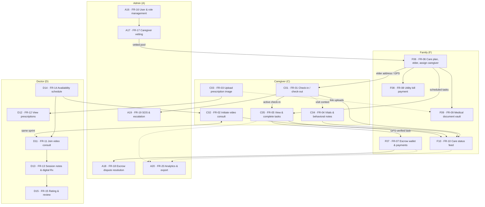
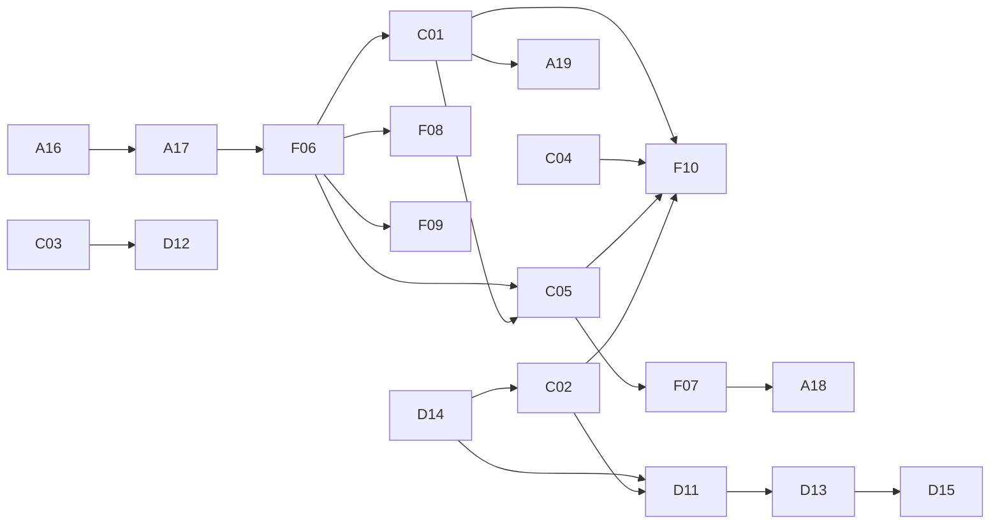
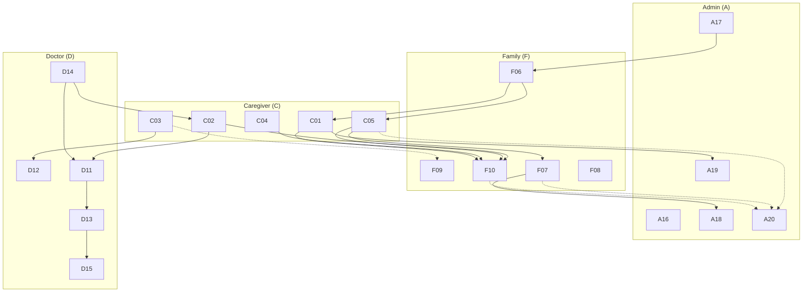

# Elder Care — FR dependency graph (Mermaid)

**Role codes:** **A** = Admin · **D** = Doctor · **C** = Caregiver · **F** = Family  
(Node **A16** = Admin, **FR-16**, and so on.)

**Legend:** Solid arrows = build the source before (or same sprint as) the target. Dashed = soft / mocks OK until the other lands.

---

## Main graph (role subgraphs A → D → C → F, cross-role dependencies)

---

## Minimal (role-prefixed IDs only)

---

## Cross-role only (hides same-role chains)

Useful when explaining **who waits on whom** between dashboards.

---

## Role → FR quick map

| Code | FRs |
|------|-----|
| **A** | 16, 17, 18, 19, 20 |
| **D** | 11, 12, 13, 14, 15 |
| **C** | 01, 02, 03, 04, 05 |
| **F** | 06, 07, 08, 09, 10 |

*Note: **D15** (FR-15) is implemented with family-facing UI; dependency still flows from **D13** after a session.*
